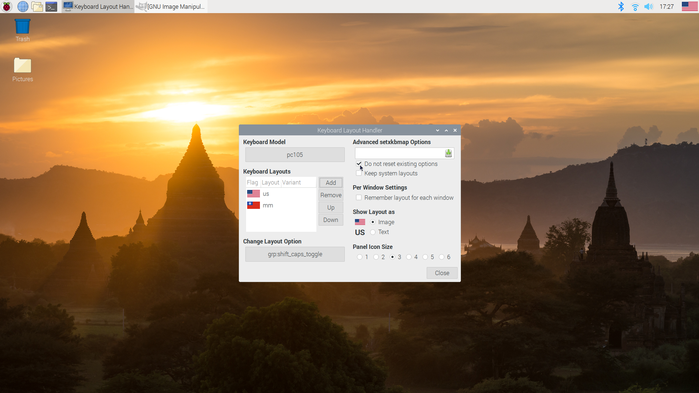

# Installing Burmese and American keyboard layout in Raspbian

Scroll down and select the Burmese keyboard layout, then click 'Add'

After you add the Burmese keyboard layout, you can close the panel window and the changes will save.

In order to save these settings, click "Do not reset existing options" and exit the panel.

To toggle between Burmese and American keyboard layouts, use Shift + Caps Lock.
