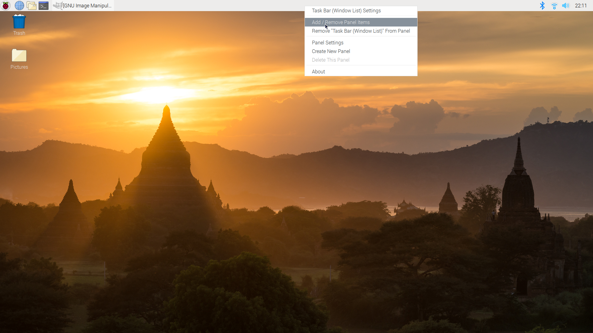
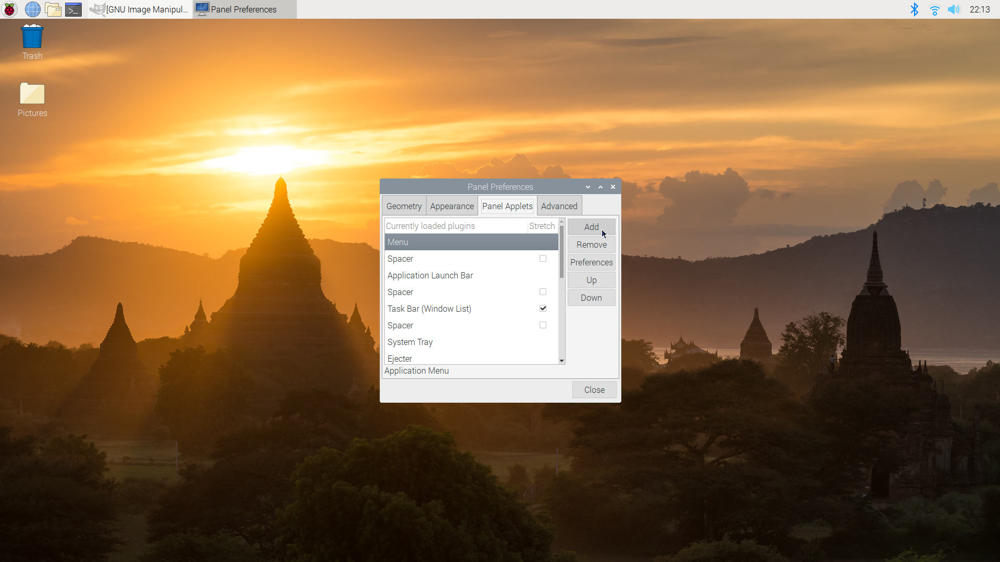
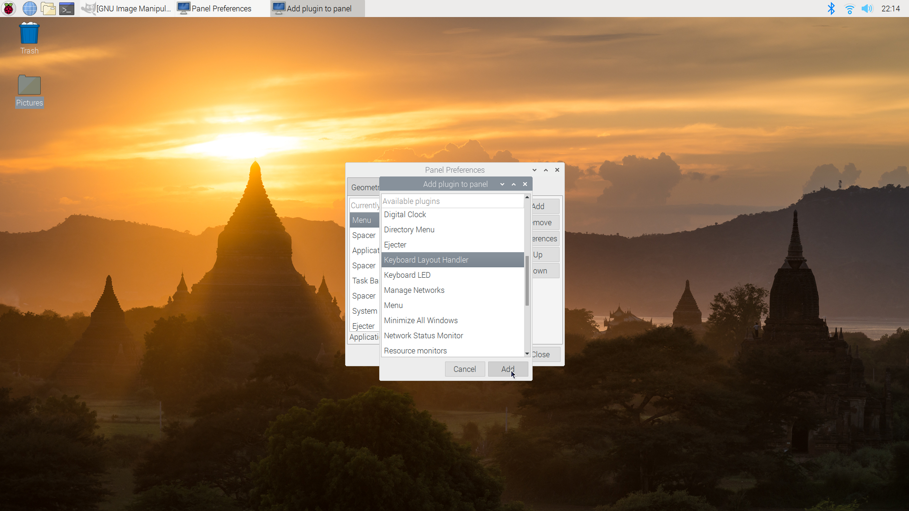
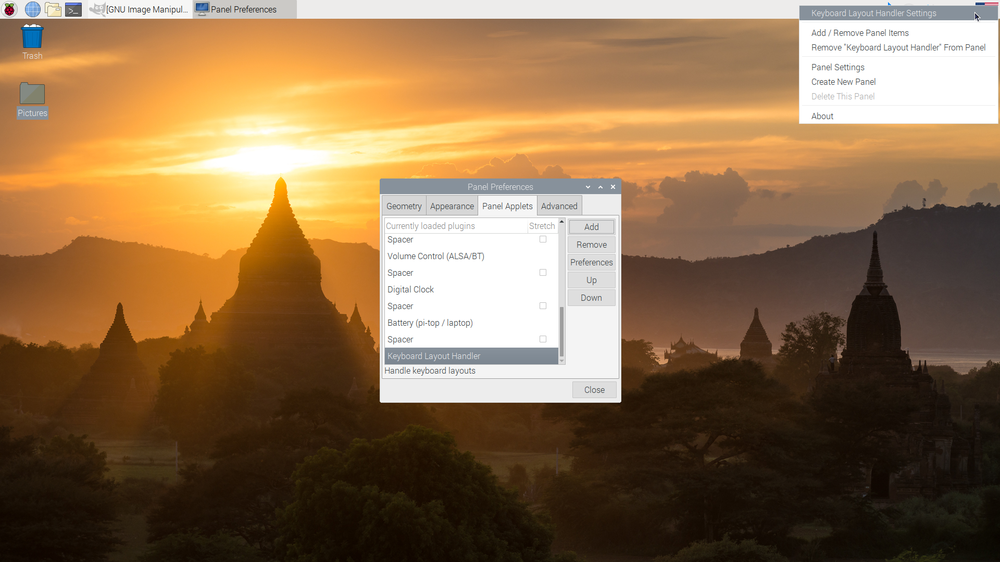
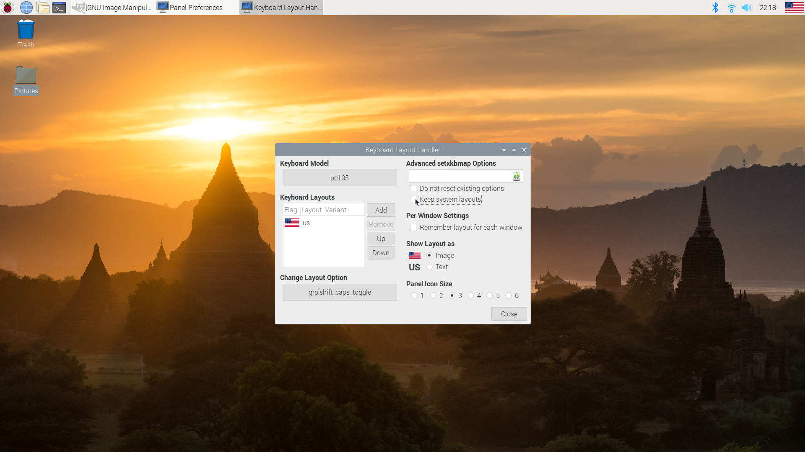
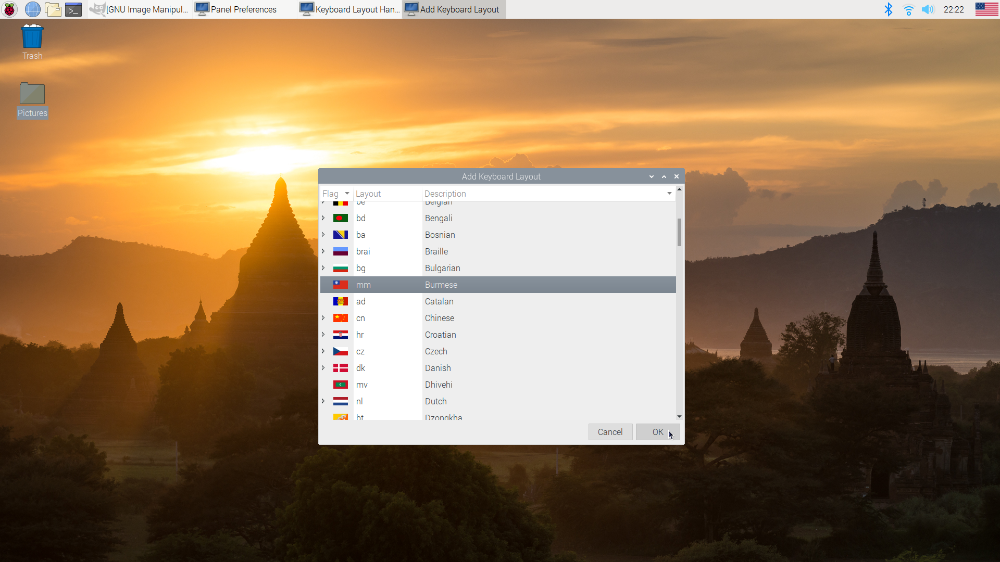

# Installing Burmese and American keyboard layout in Raspbian

After you add the Burmese keyboard layout, you can close the panel window and the changes will save.

To toggle between Burmese and American keyboard layouts, use Shift + Caps Lock.
